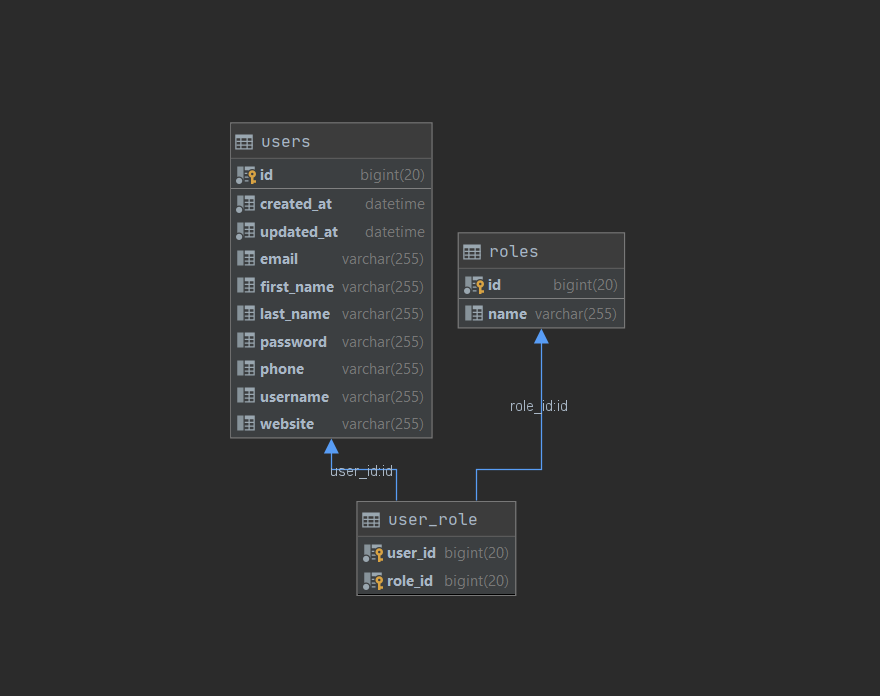

# Project User Service

> ### Spring Boot, MySQL, Spring Data Jpa, Spring Security, JUnit

Project User Service là 1 Service quản lý người dùng trong một hệ thống microservice, bao gồm các tính năng:

*   Với người dùng thông thường:
    
    *   Đăng nhập,  Đăng kí người dùng mới
    *   Xem thông tin người dùng
    *   Xem thông tin người dùng hiện tại đang đăng nhập
    *   Kiểm tra email và username có ai sử dụng hay chưa
    *   Sửa và xóa thông tin của chính người dùng đó

*   Với người dùng admin có thêm các tính năng sau:

    *   Thêm người dùng
    *   Sửa , xóa người dùng
    *   Phân quyền admin và gỡ quyền admin của một người dùng

# Bắt đầu

Cần cài đặt Java8 và Docker

Cài đặt các package

    mvn install

Để chạy test

    mvn test

Để chạy database MySQL tại cổng 3307, user root, password root

	docker-compose up

Để tạo bảng và thêm data vào database

     docker exec -i user-service-mysql-container mysql -uroot -proot < data.sql

Để tạo vào chạy bản build, project chạy tại port 9600

    mvn compile && java -jar ./target/user_service-0.0.1-SNAPSHOT.

Để vào trang Swagger

    http://localhost:9600/swagger-ui.html

Để vào trang Swagger

    mvn compile && java -jar ./target/user_service-0.0.1-SNAPSHOT.jar

# CƠ SỞ DỮ LIỆU

Sử dụng MySQL 5,7 với Diagram như sau:
*   Bảng Users: để lưu thông tin người dùng.
*   Bảng Roles: để lưu các quyền.

    

# API

### Đăng nhập
`POST /api/auth/login`

### Đăng ký
`POST /api/auth/register`

### Check mail hợp lệ
`GET /api/users/checkEmailAvailability`

### Check username hợp lệ
`GET /api/users/checkUsernameAvailability`

### Lấy thông tin người dùng
`GET /api/users/{username}/profile`

### Sửa người dùng
`PUT /api/users/{username}`

### Xóa người dùng
`DELETE /api/users/{username}`

## Với Admin

### Thêm người dùng
`POST /api/users`

### Phân quyền admin
`PUT /api/users/{username}/giveAdmin`

### Gỡ quyền admin
`PUT /api/users/{username}/removeAdmin`

# Các tính năng có thể có 

*   Gán quyền theo từng hành động từ đó gom nhóm thành một nhóm quyền, sẽ có thêm nhiều quyền như super_admin, admin, guess, user.
*   Tính năng tìm kiếm user với ElasticSearch
*   Thêm cache dùng Redis

